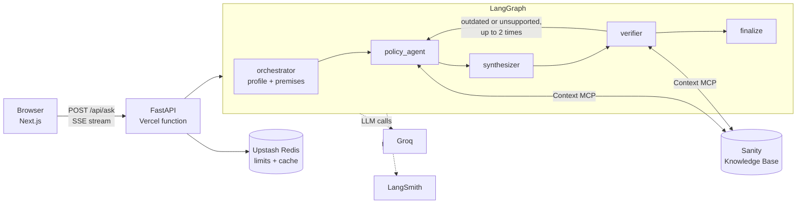

# Maple Route

Maple Route answers questions about Canadian work permit and permanent residence pathways for tech workers in Ontario. It answers only from a **Sanity Knowledge Base** of official pages, puts a citation on every claim, and shows a **Changed** note when a rule you read about is no longer current.

**Live:** https://maple-route.vercel.app

Built for the DEV.to Sanity Challenge (Path One). Information, not legal advice. Not affiliated with the Government of Canada.

## What it does

You describe your situation ("I'm a software developer in Toronto with a job offer…") or ask about something you read. Maple Route:

1. Finds the pathways that may apply, using only the Knowledge Base.
2. Cites a source for every statement. If a statement can't be backed by a source, it is removed.
3. Checks what you said against current rules. If you repeat a rule that has changed, the answer shows a **Changed** callout with the old rule, the current rule, and the source.
4. Says plainly when the sources don't cover your question.

Example: ask *"I read that a job offer gives me 50 or 200 extra points in Express Entry. Is that still true?"* Maple Route answers that job-offer points were removed from the CRS on March 25, 2025, with a Changed callout citing the official CRS page. The same model without the Knowledge Base answers "Yes… 200 points" (see [eval/results.md](eval/results.md)).

## How the Sanity Knowledge Base is used

The Policy Knowledge Base is the **only** source for policy claims. The agents never answer from the model's own knowledge or from web search.

- **Sources.** IRCC program pages, Program Delivery Instructions, news releases, Canada Gazette notices, and OINP pages, plus archived snapshots of some of them. The live official pages are connected as website sources.
- **Access.** The backend reads the Knowledge Base through **Sanity Context MCP** (Knowledge Base mode): `initial_context` for the outline of entries, and `knowledge_base_read` for the 1–3 entries a question needs. The endpoint is read-only and serves only the Knowledge Base, with no dataset source attached.
- **Provenance.** Each Knowledge Base entry ends with a numbered list of the sources it was built from. Findings cite those reference numbers, and code (not the model) resolves them to titles, URLs and dates. A claim whose source can't be found in the entry is dropped, so the model can't invent a URL.
- **Change detection.** The Knowledge Base builds its own change history: a timeline entry with "What is now outdated" and "What is currently active" sections and effective dates. The policy agent reads it alongside the topic entries, and the verifier uses it to flag outdated claims and user premises. Flagged items become **Changed** callouts in the answer.
- **Freshness.** Live official pages are refreshed on the Knowledge Base's own schedule, so answers follow the current version of each page without a redeploy.

Sanity project: `<SANITY_PROJECT_ID>` · Context MCP endpoint: `https://api.sanity.io/v1/context/organizations/omqxvfyjj/mcp/maple-route-policy` (requires a read token).

## Architecture



| Agent | Job |
|---|---|
| orchestrator | Pulls out your situation (occupation, location, status) and any rules you state as fact ("premises"). |
| policy_agent | Picks the relevant Knowledge Base entries, reads them, and extracts findings with sources. |
| synthesizer | Writes the answer using only those findings, with inline citations. |
| verifier | Checks each claim and premise against the cited entries: supported, unsupported, outdated, or conflict. Sends the draft back for a revision (at most 2) if something is outdated or unsupported. |
| finalize | Plain code: removes unsupported claims, builds the Changed callouts, adds the disclaimer. |

The API streams `step`, `claim`, `answer`, `quota` and `error` events, so the page shows each agent's progress, including "Found a rule that changed — rechecking".

Agents run on different Groq models (one env var per agent) to spread load across Groq's per-model free-tier limits. Design decisions and measurements are recorded in [docs/design.md](docs/design.md).

## Evaluation

`scripts/eval.py` runs the test questions through Maple Route and through a naive baseline (the same model with no tools) and writes [eval/results.md](eval/results.md).

```bash
uv run python -m scripts.eval              # all questions
uv run python -m scripts.eval --only 7     # one question
```

## Setup

Requirements: Python 3.13 with [uv](https://docs.astral.sh/uv/), Node.js 24.

```bash
cp .env.example .env              # fill in the values (see below)
uv sync
uv run python scripts/check_mcp.py              # lists the Knowledge Base tools
uv run python -m app.cli "Do I get extra Express Entry points for a job offer?"

# API and web app
uv run uvicorn app.main:app --port 8000
cd frontend && npm ci && NEXT_PUBLIC_API_BASE=http://localhost:8000 npm run dev
```

Tests: `uv run pytest -q`. CI runs the tests plus the frontend lint and build on every push.

**Deploy.** The repo is connected to Vercel. `vercel.json` defines two services in one project: the Next.js app (`frontend/`) and the FastAPI app (`app.main:app`), with `/api/*` routed to FastAPI. Every push to `main` deploys to production. Set the env vars below in the Vercel project settings.

## Environment variables

| Variable | Secret | Purpose |
|---|---|---|
| `SANITY_POLICY_MCP_URL` | no | Context MCP endpoint for the Policy Knowledge Base |
| `SANITY_READ_TOKEN` | **yes** | Org token with the Context Viewer role |
| `GROQ_API_KEY` | **yes** | Groq API key |
| `MODEL_ORCHESTRATOR`, `MODEL_POLICY_SELECT`, `MODEL_POLICY`, `MODEL_SYNTHESIZER`, `MODEL_VERIFIER` | no | Groq model per agent (defaults in `.env.example`) |
| `REASONING_EFFORT` | no | `low` (default), `medium` or `high`, for gpt-oss models |
| `UPSTASH_REDIS_REST_URL` | no | Upstash Redis for limits and cache. Without it, limits are kept in memory per instance |
| `UPSTASH_REDIS_REST_TOKEN` | **yes** | Upstash token |
| `DAILY_ANSWER_LIMIT` | no | Answers per day for the whole app (default 30) |
| `PER_IP_HOURLY_LIMIT` | no | Questions per IP per hour (default 5) |
| `CACHE_TTL_HOURS` | no | How long a cached answer is kept (default 12) |
| `TURNSTILE_SECRET_KEY` | **yes** | Cloudflare Turnstile server key. Required on Vercel; all questions are rejected without it |
| `NEXT_PUBLIC_TURNSTILE_SITE_KEY` | no (public by design) | Cloudflare Turnstile site key, built into the frontend |
| `LANGSMITH_API_KEY` | **yes** | LangSmith tracing |
| `LANGSMITH_TRACING`, `LANGSMITH_PROJECT` | no | `true`, `maple-route` |

## Limits and cost

Maple Route runs entirely on free tiers. Groq's free tier is shared by all users and allows roughly one new answer per minute, so the app has:

- a daily answer budget (`DAILY_ANSWER_LIMIT`), shown on the page as "N answers left today";
- a per-IP hourly limit;
- a 12-hour cache of final answers, keyed by a hash of the normalized question (cached answers don't count against the budget);
- Cloudflare Turnstile before a question is accepted.

## Limitations

- Ontario and tech-worker pathways only. The Knowledge Base holds a focused set of documents (the beta allows about 150).
- The employer lookup (positive LMIA records) is not built yet. Questions about specific employers get a "not covered" answer.
- Answers are only as current as the Knowledge Base's last refresh of each page.
- Many Knowledge Base citations carry a page title but no URL, so some sources link to a title only.
- English only.

## Privacy

Maple Route has no database of its own and stores no conversation history. Questions are not stored. Cache keys are hashes, and cached values hold only the final answer. LangSmith traces (used for debugging) do contain the question text. See the `/privacy` page.

## Disclaimer

This is information from official sources, not legal advice. For your specific case, talk to a licensed immigration consultant (RCIC) or lawyer. Maple Route is an independent project and is not affiliated with the Government of Canada.
