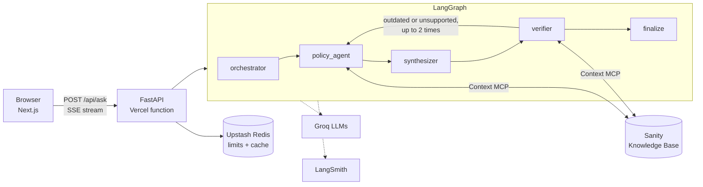

# Maple Route

A multi-agent AI system that answers questions about a **small set of Canadian immigration topics**, using only official pages stored in a Sanity Knowledge Base:

- Express Entry points (CRS criteria)
- open work permits for spouses and family members
- post-graduation work permit eligibility
- 2026 changes to the Ontario Immigrant Nominee Program
- a few related canada.ca pages, such as the Global Talent Stream

Four AI agents work on each question, and a final code step removes anything the sources don't support. Every claim has a citation, rules the user mentions are flagged if they have changed, and questions outside these pages get a "not covered" answer. Built with tech workers in mind.

**Live:** https://maple-route.vercel.app · **Demo video:** https://youtu.be/1-cmFlTunG8

Information, not legal advice. Not affiliated with the Government of Canada.

## Scope: read this first

Maple Route covers only a **small set of official pages**. Many programs, exceptions and recent updates are not in its sources, so it can't answer every question, and an answer may leave out rules that apply to you.

Use it as a starting point: to learn which options might exist for you, and to notice when a rule you heard about has changed. **Do not use it as legal advice.** Before you make a decision or apply, check the official pages yourself and talk to a licensed immigration consultant (RCIC) or a lawyer.

The Knowledge Base is built from these pages:

| Source | Topic |
|---|---|
| [canada.ca: Express Entry CRS criteria](https://www.canada.ca/en/immigration-refugees-citizenship/services/immigrate-canada/express-entry/check-score/crs-criteria.html) | Express Entry points |
| [canada.ca: Open work permits for family members, eligibility](https://www.canada.ca/en/immigration-refugees-citizenship/services/work-canada/special-instructions/spouses-dependent-children/eligibility.html) | Spouse and family work permits |
| [canada.ca: Post-graduation work permit, eligibility](https://www.canada.ca/en/immigration-refugees-citizenship/services/study-canada/work/after-graduation/eligibility.html) | Post-graduation work permits |
| [canada.ca: Immigration, Refugees and Citizenship](https://www.canada.ca/en/immigration-refugees-citizenship.html) (3 documents) | IRCC home page and a few related pages, such as the Global Talent Stream |
| [ontario.ca: 2026 Ontario Immigrant Nominee Program updates](https://www.ontario.ca/page/2026-ontario-immigrant-nominee-program-updates) | OINP changes |

## Architecture



Four nodes are LLM agents; `finalize` is plain code.

| Node | Does | Code |
|---|---|---|
| orchestrator | Extracts the user's profile and any rules they state as fact ("premises"). No tools. | `app/graph/nodes.py` |
| policy_agent | Fixed pipeline: pick ≤ 3 Knowledge Base entries (plus the change timeline) → read → extract findings with sources. | `app/graph/nodes.py`, `app/graph/kb.py` |
| synthesizer | Writes the answer as units that reference finding ids. No tools. | `app/graph/nodes.py` |
| verifier | Checks every claim and premise against the cited entry text. Statuses: `supported`, `unsupported`, `outdated`, `conflict`. Loops back to `policy_agent` (max 2) when something is outdated or unsupported. | `app/graph/nodes.py` |
| finalize | Plain code: drops unsupported claims, numbers the sources, builds the "Changed" callouts, adds the disclaimer. | `app/graph/nodes.py` |

System prompts live in `app/prompts/`, one file per step. Each agent uses its own model (one env var per agent), which spreads load across Groq's per-model free-tier limits. Design decisions and measurements are in [docs/design.md](docs/design.md).

### Knowledge Base access

- Endpoint: Sanity Context MCP in Knowledge Base mode, `https://api.sanity.io/v1/context/organizations/<orgId>/mcp/<name>`, with `Authorization: Bearer <SANITY_READ_TOKEN>` (`app/mcp/client.py`). The endpoint has no dataset source attached; a dataset source would override the Knowledge Bases.
- Tools used: `initial_context` (the entry outline, cached for 10 minutes) and `knowledge_base_read` (1–3 entries per call, trimmed to stay inside Groq's per-minute token limit). All calls in a step share one MCP session.
- Provenance: each entry ends with a `## Sources` list. Findings cite a reference number, and `kb.citations()` resolves it to a title, URL and date. A finding whose reference isn't in the entry is dropped.
- Changes: the Knowledge Base generates a policy timeline entry ("What is now outdated" / "What is currently active", with effective dates). The policy agent reads it, and the verifier uses it to mark outdated claims and premises.

### API

`POST /api/ask` with `{ "question": string, "turnstileToken": string }` returns a Server-Sent Events stream:

| Event | Payload |
|---|---|
| `step` | `{ agent, status: "started" \| "finished" \| "waiting", summary }` |
| `claim` | a verified claim |
| `answer` | `{ text, claims, conflicts, sources, disclaimer, revisions }` |
| `quota` | `{ remainingToday }` |
| `error` | `{ code, message }`; codes: `quota_exhausted`, `rate_limited`, `upstream_busy`, `invalid_input`, `internal` |

`GET /api/quota` returns `{ remainingToday, resetsAt }`.

Request handling, in order: input length check → Turnstile → cache lookup (cached answers are free) → per-IP hourly limit → daily answer budget → graph run. A failed run refunds its budget slot. On a Groq 429 the run waits once and retries; it then returns `upstream_busy`, or `quota_exhausted` if the daily Groq limit was hit.

## Running locally

Requirements: Python 3.13 with [uv](https://docs.astral.sh/uv/), Node.js 24.

```bash
cp .env.example .env                       # fill in the values below
uv sync
uv run python scripts/check_mcp.py         # lists the Knowledge Base tools
uv run python -m app.cli "Do I get extra Express Entry points for a job offer?"
uv run python -m app.cli --debug "…"       # also prints premises and verifier verdicts

# API + web app
uv run uvicorn app.main:app --port 8000
cd frontend && npm ci && NEXT_PUBLIC_API_BASE=http://localhost:8000 npm run dev
```

Without Turnstile or Upstash keys, local runs skip the bot check and keep limits in memory.

`scripts/mock_kb_server.py` is a local MCP server with the same tool contract as Context MCP, for working without the real Knowledge Base.

## Tests and evaluation

```bash
uv run pytest -q                           # unit and API tests (no network)
uv run python -m scripts.eval              # test questions vs. a no-tools baseline
uv run python -m scripts.eval --only 7     # one question
```

`scripts/eval.py` runs each test question through the graph and through the same model with no tools, and writes [eval/results.md](eval/results.md). CI (`.github/workflows/ci.yml`) runs the tests, the frontend lint and the frontend build on every push.

## Deployment

The repo is connected to Vercel, and every push to `main` deploys to production. `vercel.json` defines two services in one project: the Next.js app (`frontend/`) and the FastAPI app (`app.main:app`), with `/api/*` routed to FastAPI. Answers stream over SSE from the Python function (Vercel Hobby allows up to 300 s; a typical answer takes 5–20 s).

## Environment variables

| Variable | Secret | Purpose |
|---|---|---|
| `SANITY_POLICY_MCP_URL` | no | Context MCP endpoint for the Policy Knowledge Base |
| `SANITY_READ_TOKEN` | **yes** | Org token with the Context Viewer role |
| `GROQ_API_KEY` | **yes** | Groq API key |
| `MODEL_ORCHESTRATOR`, `MODEL_POLICY_SELECT`, `MODEL_POLICY`, `MODEL_SYNTHESIZER`, `MODEL_VERIFIER` | no | Groq model per step (defaults in `.env.example`) |
| `REASONING_EFFORT` | no | `low` (default), `medium` or `high`, for gpt-oss models |
| `UPSTASH_REDIS_REST_URL` | no | Upstash Redis for limits and cache. Without it, limits are kept in memory per instance |
| `UPSTASH_REDIS_REST_TOKEN` | **yes** | Upstash token |
| `DAILY_ANSWER_LIMIT` | no | Answers per day for the whole app (default 30) |
| `PER_IP_HOURLY_LIMIT` | no | Questions per IP per hour (default 5) |
| `CACHE_TTL_HOURS` | no | How long a cached answer is kept (default 12) |
| `TURNSTILE_SECRET_KEY` | **yes** | Cloudflare Turnstile server key. Required on Vercel; questions are rejected without it |
| `NEXT_PUBLIC_TURNSTILE_SITE_KEY` | no (public) | Cloudflare Turnstile site key, built into the frontend |
| `LANGSMITH_API_KEY` | **yes** | LangSmith tracing |
| `LANGSMITH_TRACING`, `LANGSMITH_PROJECT` | no | `true`, `maple-route` |

## Limitations

- Only the official pages listed under [Scope](#scope-read-this-first) are in the Knowledge Base. Questions outside them get a "not covered" answer, and answers may miss rules from pages that aren't included.
- The employer lookup (positive LMIA records) is not built. Employer questions get a "not covered" answer.
- Answers are only as current as the Knowledge Base's last refresh of each page.
- Many Knowledge Base citations have a page title but no URL.
- English only.

## Privacy

No database of our own and no conversation history. Questions are not stored; cache keys are hashes and cached values hold only the final answer. LangSmith traces (for debugging) contain the question text. See `/privacy` on the site.

## Disclaimer

Maple Route is a reference to help you see possible options and notice policy changes. It is not legal advice, and it is not complete. For your specific case, talk to a licensed immigration consultant (RCIC) or lawyer.

Built for the [DEV.to Sanity Challenge](https://dev.to/challenges/sanity-2026-09-16) (Path One).
